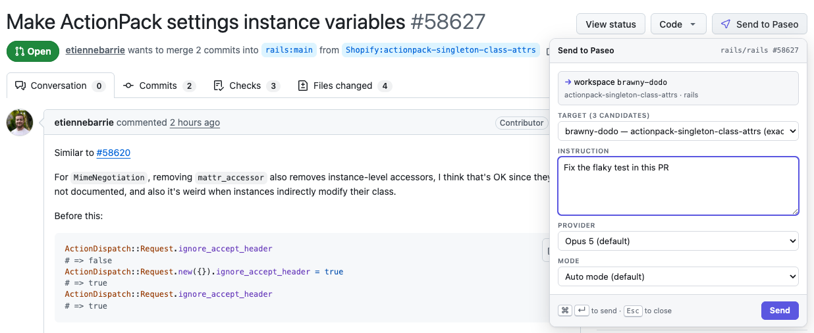

# send-to-paseo

[](https://paseo.sh)
[](https://chromewebstore.google.com/detail/send-to-paseo/blflbbgkckbabbkoigpocilbkkmfijfg)
[](https://github.com/tomgrin10/send-to-paseo/releases/latest)
[](LICENSE)

Send instructions from GitHub and Graphite pull requests to your [Paseo](https://paseo.sh) agents.
Choose a workspace, start a new agent or continue with an existing one, and send.



- Reuse an existing workspace or check out the pull request in a new worktree.
- Keep stacked pull requests in the same workspace.
- Send work to your laptop or another connected Paseo machine.

## Install

Requires [Paseo](https://paseo.sh) 0.9.0 or newer and `git` on the computer running Chrome.

1. **Add the extension.** Open [Send to Paseo in the Chrome Web Store](https://chromewebstore.google.com/detail/send-to-paseo/blflbbgkckbabbkoigpocilbkkmfijfg)
   and click **Add to Chrome**.
2. **Install the Paseo plugin.** Enable plugins in Paseo's **Settings → Plugins**, then run:

   ```sh
   paseo plugin install send-to-paseo
   ```

3. **Pair once.** In Paseo, open **Send to Paseo** and copy the **pairing token**. Click the
   extension's icon in Chrome's Extensions menu, paste the token, and press **Test connection**.

Open a GitHub or Graphite pull request, click **Send to Paseo**, type an instruction, and press
**Send**. Chrome keeps the extension up to date automatically.

## Add another Paseo machine

Configure the other computer as a host in Paseo and install the plugin there, then:

1. On that computer, open **Send to Paseo → Share this Paseo machine**, click **Enable private
   access**, and copy the connection code.
2. On the computer running Chrome, open **Send to Paseo → Paseo machines**, find that machine,
   paste the code, and click **Connect additional machine**.

Private access uses Tailscale Serve on the other computer. Keep connection codes private.
See the [connection guide](plugin/README.md#connect-primary-and-additional-paseo-machines)
for requirements and manual setup.

## Troubleshooting

- **No button:** check that the extension is enabled and refresh the GitHub or Graphite PR page.
- **Can't reach Paseo:** run `paseo plugin ls` to check that the plugin is running, then
  `paseo plugin logs send-to-paseo` for details.
- **Token rejected:** copy the pairing token again from the plugin on the computer running Chrome.
- **Update required:** update the plugin and extension so they use compatible versions.

More help: [plugin troubleshooting](plugin/README.md#troubleshooting) and
[extension troubleshooting](extension/README.md#troubleshooting).

## Privacy and security

No ads, analytics, or telemetry. Requests go to the Paseo bridges you configure. Pairing tokens
stay in Chrome extension storage and are never exposed to the PR page's JavaScript.

The plugin runs locally and can start agents on your machine. See the
[privacy policy](PRIVACY.md) and [security model](plugin/README.md#security-model) for details.

## Development

<details>
<summary>Build from source or install an unpacked extension</summary>

To build the extension, install Node and npm, then run:

```sh
git clone https://github.com/tomgrin10/send-to-paseo
cd send-to-paseo/extension
npm install
npm run build
```

Open `chrome://extensions`, enable **Developer mode**, click **Load unpacked**, and select
`extension/dist`. Alternatively, unzip `send-to-paseo-extension.zip` from the
[latest release](https://github.com/tomgrin10/send-to-paseo/releases/latest) and load that folder.
Keep the folder in a permanent location; unpacked installations need manual updates.

To install the plugin from a checkout:

```sh
paseo plugin add /absolute/path/to/send-to-paseo/plugin
```

See [AGENTS.md](AGENTS.md) for verification commands and release procedures.
Version tags trigger npm publication, the GitHub release and extension ZIP, and Chrome review
submission. [Publishing setup and recovery](docs/chrome-web-store/AUTOMATION.md).

</details>

- [Plugin docs](plugin/README.md): requirements, configuration, workspace resolution, and security.
- [Extension docs](extension/README.md): building, pairing, and browser integration.
- [Bridge contract](CONTRACT.md) and [design notes](PLAN.md).
- Verification records: [plugin](plugin/VERIFICATION.md) and [extension](extension/VERIFICATION.md).

## Credits

The extension uses Paseo's brand mark and Lucide's settings icon. Paseo is Apache-2.0,
© 2025-present Mohamed Boudra; Lucide is ISC.

## More Paseo plugins

Also available from [Tom Gringauz](https://github.com/tomgrin10):

- [Defer](https://github.com/tomgrin10/paseo-defer) — Schedule messages to agents for later delivery.
- [Graphite](https://github.com/tomgrin10/paseo-graphite) — Monitor Graphite stacks and PR action state.
- [Smart Session](https://github.com/tomgrin10/paseo-smart-session) — Context-aware compaction and usage insights for long-running agents.
- [Vitals](https://github.com/tomgrin10/paseo-vitals) — Host, Paseo, agent, and Docker health in one dashboard.

## License

[MIT](LICENSE) © 2026 Tom Gringauz.
